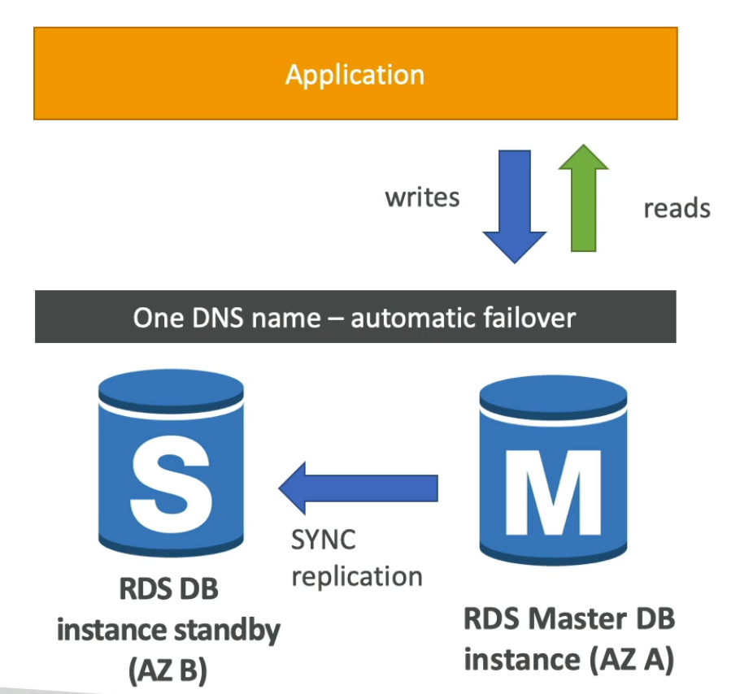
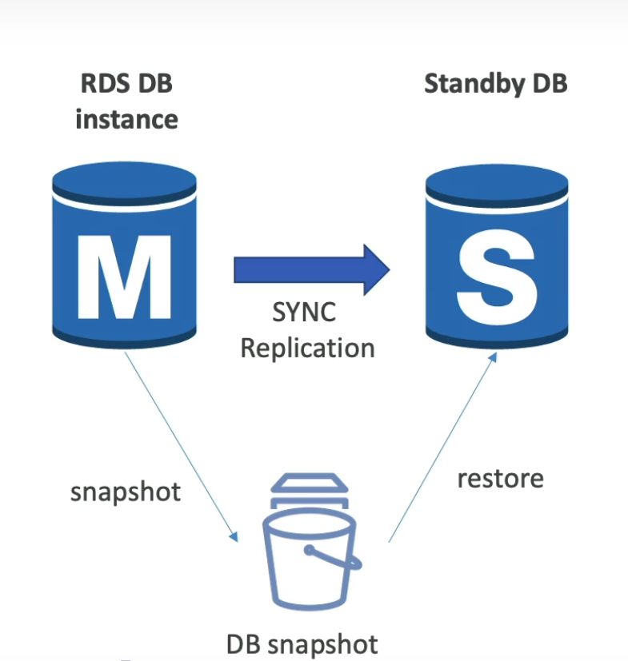

# RDS Read Replicas vs Multi-AZ

## 1. 개요

Amazon RDS에서 고가용성과 확장성을 제공하는 두 가지 주요 기능인 **읽기 복제본 (Read Replicas)**과 **다중 AZ 배포 (Multi-AZ Deployment)**를 비교합니다. 이 두 기능은 서로 다른 목적을 가지고 있으며, 애플리케이션의 요구사항에 따라 선택해야 합니다.

---

## 2. 읽기 복제본 (Read Replicas)

### 2.1 개념
- **정의**: 소스 RDS 인스턴스의 읽기 전용 복사본
- **목적**: 읽기 트래픽 분산 및 성능 향상
- **복제 방식**: 비동기 복제 (Asynchronous Replication)

### 2.2 주요 특징
- **생성**: 최대 15개까지 생성 가능
- **위치**: 동일 리전 내 또는 크로스 리전
- **사용**: 읽기 쿼리 전용 (쓰기 불가)
- **프로모션**: 읽기 복제본을 독립된 DB 인스턴스로 승격 가능
- **비용**: 각 복제본에 대해 별도 요금 부과

### 2.3 장점
- **확장성**: 읽기 부하 분산
- **지연 시간**: 글로벌 애플리케이션용 크로스 리전 복제
- **백업**: 복제본에서 백업 수행으로 소스 DB 부하 감소

### 2.4 단점
- **지연**: 비동기 복제로 인한 잠재적 데이터 지연
- **장애 조치**: 자동 장애 조치 없음 (수동 프로모션 필요)
- **비용**: 추가 인스턴스 비용

---

## 3. 다중 AZ 배포 (Multi-AZ Deployment)

### 3.1 개념
- **정의**: 기본 리전의 다른 가용 영역(AZ)에 대기 인스턴스 배포
- **목적**: 고가용성 및 자동 장애 조치
- **복제 방식**: 동기 복제 (Synchronous Replication)
    - **Disaster Recovery (DR, 재해 복구)**: AZ 전체 장애, 네트워크 문제 등 예기치 않은 상황에서 데이터베이스를 복구할 수 있는 기능
        - **SYNC replication**: 데이터를 실시간으로 동기화하여 기본 인스턴스와 대기 인스턴스 간 데이터 일관성을 보장
        - **One DNS name - automatic app failover to standby**: 하나의 DNS 엔드포인트를 사용하여 애플리케이션이 자동으로 대기 인스턴스로 전환되므로 애플리케이션 코드 변경 불필요
        - **Increase availability**: 시스템 가용성을 높여 99.95% 이상의 SLA 달성 가능
        - **Failover in case of loss of AZ, loss of network, instance or storage failover**: AZ 손실, 네트워크 장애, 인스턴스 고장, 스토리지 문제 발생 시 자동 장애 조치 수행
        - **No manual intervention in apps**: 애플리케이션 측에서 수동으로 개입할 필요 없이 자동으로 처리됨
    - **참고**: Read Replica는 Disaster Recovery(DR)를 위해 Multi-AZ로 설정될 수 있지만, 기본적으로 읽기 전용 복제본입니다. Multi-AZ는 고가용성을 위한 동기 복제입니다.

        

#### RDS - From Single-AZ to Multi-AZ
- **Zero downtime operation (no need to stop the DB)**: 데이터베이스를 중지할 필요 없이 가동 중지 시간 없이 수행되는 작업으로, 프로덕션 환경에서 안전하게 설정 변경 가능
- **Just click on 'modify' for the database**: RDS 콘솔에서 데이터베이스를 선택한 후 '수정' 버튼을 클릭하기만 하면 됩니다. 복잡한 수동 작업이 필요 없음
- **The following happens internally**: AWS가 내부적으로 자동으로 처리하는 단계들로, 사용자 개입 최소화
    - **A snapshot is taken**: 현재 데이터베이스의 스냅샷(백업)을 생성하여 데이터 손실을 방지합니다. 이 과정은 매우 빠르게 수행됩니다.
    - **A new DB is restored from the snapshot in a new AZ**: 생성된 스냅샷을 사용하여 다른 AZ에 새 데이터베이스 인스턴스를 복원합니다. 이렇게 하면 대기 인스턴스가 준비됩니다.
    - **Synchronization is established between the two databases**: 기본 인스턴스와 새로 생성된 대기 인스턴스 간에 동기 복제(SYNC replication)가 설정되어 실시간 데이터 동기화가 시작됩니다.

    

### 3.2 주요 특징
- **구성**: 기본 인스턴스 + 대기 인스턴스 (1:1)
- **장애 조치**: 자동 (일반적으로 60-120초 소요)
- **사용**: 대기 인스턴스는 읽기 전용 아님 (장애 시에만 활성화)
- **백업**: 자동 백업 및 포인트 인 타임 복원 지원
- **비용**: 기본 인스턴스 비용의 2배 (대기 인스턴스 무료)

### 3.3 장점
- **고가용성**: AZ 장애 시 자동 복구
- **데이터 내구성**: 동기 복제로 데이터 손실 최소화
- **투명성**: 애플리케이션에 장애 조치 투명

### 3.4 단점
- **읽기 확장**: 읽기 트래픽 분산 불가
- **비용**: 스토리지 비용 2배 (컴퓨팅은 대기 무료)
- **지연**: 동기 복제로 인한 약간의 성능 영향

---

## 4. 비교 표

| 측면 | 읽기 복제본 | 다중 AZ 배포 |
|------|-------------|-------------|
| **주요 목적** | 읽기 성능 향상 | 고가용성 |
| **복제 방식** | 비동기 | 동기 |
| **읽기 트래픽** | 분산 가능 | 분산 불가 |
| **쓰기 트래픽** | 소스 DB만 | 기본 DB만 |
| **장애 조치** | 수동 (프로모션) | 자동 |
| **최대 개수** | 15개 | 1개 (대기) |
| **크로스 리전** | 가능 | 불가 (동일 리전) |
| **비용** | 추가 인스턴스 비용 | 스토리지 2배 |
| **사용 사례** | 읽기 집약적 앱 | 고가용성 요구 앱 |

---

## 5. 사용 사례

### 5.1 읽기 복제본 적합 사례
- **읽기 중심 애플리케이션**: 블로그, 뉴스 사이트 등
- **글로벌 애플리케이션**: 크로스 리전으로 지연 시간 단축
- **보고 및 분석**: 읽기 쿼리로 소스 DB 부하 감소
- **백업 오프로딩**: 복제본에서 백업 수행

### 5.2 다중 AZ 배포 적합 사례
- **프로덕션 데이터베이스**: 가동 중지 시간 최소화
- **금융 애플리케이션**: 데이터 일관성 및 내구성 중요
- **e커머스 플랫폼**: 24/7 가용성 요구
- **규제 준수**: 데이터 손실 방지 필요

### 5.3 결합 사용
- **다중 AZ + 읽기 복제본**: 고가용성 + 읽기 확장
- **Aurora 클러스터**: 내장된 읽기 확장 + 고가용성

---

## 6. 설정 및 관리

### 6.1 읽기 복제본 생성
1. RDS 콘솔 → 인스턴스 선택 → "작업" → "읽기 복제본 생성"
2. 복제본 식별자, 인스턴스 클래스, 스토리지 설정
3. 소스 DB와 동일한 리전 또는 다른 리전 선택
4. 생성 후 DNS 엔드포인트로 연결

### 6.2 다중 AZ 활성화
1. RDS 콘솔 → 인스턴스 선택 → "수정"
2. "배포" 섹션에서 "다중 AZ 배포" 활성화
3. 변경 사항 적용 (즉시 또는 유지 관리 윈도우)

### 6.3 모니터링
- **CloudWatch 메트릭**: 복제 지연, 장애 조치 이벤트
- **로그**: 복제 오류, 장애 조치 로그
- **알람**: 지연 임계값 초과 시 알림

---

## 7. 비용 고려사항

### 7.1 읽기 복제본 비용
- **컴퓨팅**: 각 복제본에 인스턴스 비용
- **스토리지**: 복제본에 데이터 복사 비용
- **데이터 전송**: 크로스 리전 시 전송 비용

### 7.2 다중 AZ 비용
- **컴퓨팅**: 대기 인스턴스 무료
- **스토리지**: 기본 + 대기 스토리지 비용
- **백업**: 자동 백업 스토리지 비용

### 7.3 최적화 팁
- **예약 인스턴스**: 장기 사용 시 할인
- **Aurora 사용**: 더 효율적인 복제
- **사용량 모니터링**: 불필요한 복제본 제거

---

## 8. SAA 시험 관련 문제

### 문제 1: 읽기 복제본 vs 다중 AZ
회사의 애플리케이션이 읽기 트래픽이 많고, 가동 중지 시간을 최소화해야 합니다. 어떤 RDS 기능을 조합해야 합니까?

A) 다중 AZ 배포만  
B) 읽기 복제본만  
C) 다중 AZ + 읽기 복제본  
D) Aurora Serverless  

**정답: C**  
**설명**: 다중 AZ는 고가용성을, 읽기 복제본은 읽기 확장성을 제공합니다. 둘을 결합하면 최적의 솔루션입니다.

### 문제 2: 복제 방식
다중 AZ 배포에서 사용하는 복제 방식은 무엇입니까?

A) 비동기 복제  
B) 동기 복제  
C) 스냅샷 복제  
D) 로그 기반 복제  

**정답: B**  
**설명**: 다중 AZ는 동기 복제를 사용하여 데이터 일관성을 보장합니다.

### 문제 3: 읽기 복제본 제한
읽기 복제본의 최대 개수는 몇 개입니까?

A) 5개  
B) 10개  
C) 15개  
D) 20개  

**정답: C**  
**설명**: RDS는 최대 15개의 읽기 복제본을 지원합니다.
