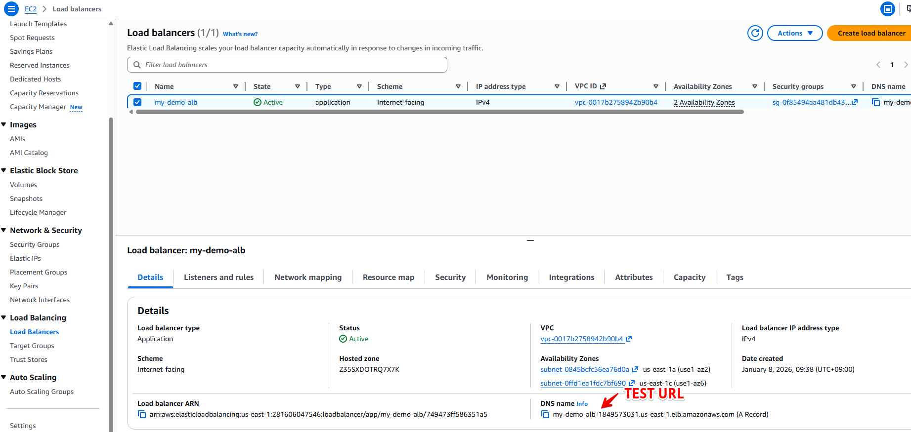

# ALB (Application Load Balancer) – SAA 시험 대비 정리

## 1️⃣ ALB 기본 개념

### ALB란?
- **Layer 7 (Application Layer)** 로드 밸런서
- HTTP / HTTPS 트래픽 처리
- 요청의 **내용(URL, Host, Header 등)** 을 보고 라우팅 가능

### 핵심 키워드
- Layer 7
- HTTP / HTTPS
- Intelligent Routing

---

## 2️⃣ ALB의 주요 기능 (시험 핵심)

### ① Content-based Routing ⭐⭐⭐
요청 내용을 기준으로 Target Group을 선택

#### 지원 기준
- **Host-based routing**
  - `api.example.com`
  - `www.example.com`
- **Path-based routing**
  - `/users`
  - `/images`
- **Query String / Header 기반 라우팅**

👉 시험에서 “URL에 따라 다른 서비스로 보낸다” → **ALB**

---

### ② Target Group 개념 ⭐⭐⭐
ALB는 **Target Group** 단위로 트래픽 전달

#### Target Group 대상
- EC2
- ECS Task
- Lambda
- IP 주소 (온프레미스 포함)

📌 ALB → Target Group → 실제 대상

---

### ③ Dynamic Port Mapping (ECS) ⭐⭐
- ECS + ALB 조합에서 자주 등장
- 컨테이너가 **동적 포트**를 사용해도 ALB가 자동 매핑

---

### ④ Health Check ⭐⭐
- Target Group 단위로 헬스 체크
- HTTP 상태 코드 기반 (200 OK 등)
- 비정상 인스턴스는 자동 제외

---

## 3️⃣ ALB와 High Availability

### 특징
- **Multi-AZ 기본 지원**
- ALB 자체는 관리형 서비스 → 장애 걱정 ❌

### 자주 나오는 조합
- ALB + Auto Scaling Group + Multi-AZ
→ **확장성 + 고가용성**

---

## 4️⃣ ALB vs 다른 Load Balancer (비교 문제 대비)

### ALB vs NLB
| 항목 | ALB | NLB |
|----|----|----|
| 계층 | Layer 7 | Layer 4 |
| 프로토콜 | HTTP / HTTPS | TCP / UDP |
| 라우팅 | Content 기반 | 포트 기반 |
| 성능 | 보통 | 초고성능 / 초저지연 |

👉 “URL / Host 기반” → ALB  
👉 “초고성능 / TCP” → NLB

---

### ALB vs CLB
- CLB는 **레거시**
- 시험에서는 거의 **ALB / NLB 선택**

---

## 5️⃣ SAA 시험 문제 패턴 ⭐⭐⭐

### 패턴 1
> “URL 경로에 따라 다른 백엔드 서비스로 트래픽을 분산해야 한다”

👉 **ALB + Path-based Routing**

---

### 패턴 2
> “하나의 로드 밸런서로 여러 마이크로서비스를 운영해야 한다”

👉 **ALB + Multiple Target Groups**

---

### 패턴 3
> “HTTP 헤더 또는 쿼리 스트링 기반 라우팅이 필요하다”

👉 **ALB**

---

### 패턴 4
> “Lambda로 HTTP 요청을 직접 처리해야 한다”

👉 **ALB → Lambda Target Group**

---

## 6️⃣ 자주 나오는 함정 ❌

### 함정 ①
- “Layer 4 성능이 중요” → ALB ❌  
👉 정답: **NLB**

### 함정 ②
- “ALB는 EC2만 지원한다” ❌  
👉 Lambda / IP / ECS도 지원

### 함정 ③
- “ALB는 Single AZ” ❌  
👉 기본적으로 **Multi-AZ**

---

## 7️⃣ 한 줄 요약 (시험용 암기)

> **ALB = HTTP/HTTPS + Layer 7 + Content-based Routing**

> **URL / Host / Header 나오면 무조건 ALB부터 의심**

---
# Application Load Balancer (ALB) – Practice Questions (SAA Style)

---

## Question 1

### **Question (English)**  
Which AWS service should be used to route HTTP requests to different backend services based on URL path patterns?

### **Choices (English)**  
A. Network Load Balancer  
B. Application Load Balancer  
C. Classic Load Balancer  
D. Amazon Route 53  

### **Correct Answer**  
**B. Application Load Balancer**

### **Explanation (한글)**  
- URL 경로(`/api`, `/images` 등)에 따라 트래픽을 분기하는 기능은 **Layer 7(Application Layer)** 기능이다.  
- **Application Load Balancer(ALB)** 는 **Path-based Routing**을 지원한다.  
- Network Load Balancer는 Layer 4(TCP/UDP)로 URL을 해석할 수 없다.  
- Route 53은 DNS 레벨 라우팅으로, HTTP 요청 단위의 경로 기반 라우팅을 하지 않는다.

---

## Question 2

### **Question (English)**  
A company runs multiple microservices behind a single load balancer. Each service must receive traffic based on the hostname in the HTTP request. Which solution meets this requirement?

### **Choices (English)**  
A. Network Load Balancer with multiple listeners  
B. Application Load Balancer with host-based routing  
C. Classic Load Balancer with multiple target groups  
D. Auto Scaling Group with Route 53 weighted routing  

### **Correct Answer**  
**B. Application Load Balancer
